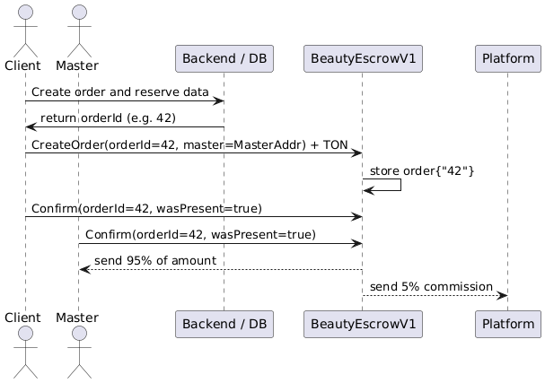

# BeautyEscrowV1 Smart Contract (v1)

This is the **first iteration** of a decentralized escrow contract for the beauty service industry, used in a hackathon prototype. It facilitates fair payment handling between beauty masters and their clients, with simple dispute resolution.

### Overview

- **One contract instance**, deployed by the platform.
- **Orders** are created off-chain with a pre-defined `orderId`.
- **Clients** send TON when creating an order, specifying the master's address.
- Both parties can later confirm attendance (present or absent).
- The contract resolves payments based on confirmations and distributes TON accordingly.
- A **platform commission** is applied (configurable at init).

### Flow Description

1. **Client** generates an `orderId` and calls `CreateOrder`, sending TON along with the master's address.
2. The contract stores the order using the external `orderId` and awaits confirmations.
3. **Client** and **Master** each submit a `Confirm` message, indicating whether the appointment was attended.
4. Once both responses are received:
   - If both attended → Master is paid, platform takes commission.
   - If both say client didn't show up → Full refund to client.
   - If there's a mismatch → Commission is taken, remainder is split 50/50 between client and master.

5. Contract state for the order is finalized.

### Roadmap (Planned Contract Versions)

| Version | Description                                                                                                                                                                                                                                                                                                                                                                                    |
| ------- | ---------------------------------------------------------------------------------------------------------------------------------------------------------------------------------------------------------------------------------------------------------------------------------------------------------------------------------------------------------------------------------------------- |
| **v2**  | **Timeout-based Auto-finalization** New `receive: AutoFinalize(orderId)` message. If one party confirmed and the other has not responded within a set time window (e.g. 24h), the contract finalizes in favor of the confirming party. If **neither responded** within a longer period (e.g. 3 days), funds go to master by default. This function can be triggered by backend cron or bot. |
| **v3**  | **Off-chain Moderation Support** Add admin/moderator panel. Moderator can submit dispute resolution messages on-chain. Contract exposes specific `receive` calls for admin to resolve: full refunds, partial refunds, no refunds. Signature-based verification (off-chain signed result).                                                                                                   |
| **v4**  | **Per-Master or Per-Order Contracts (“TON-like” pattern)** Instead of one global contract, each master (or even each order) may have a dedicated contract instance for more granular payments/trust. Explore architecture: templates deployment, gas optimization, ownership.                                                                                                               |
| **v5**  | **Gift Certificate Support via NFTs** Enable issuance of gift certificates as NFTs (JETTON). Client can pay with or gift NFTs. Contract supports redemption logic by master, with remaining commission logic.                                                                                                                                                                               |

### Example Test Case

See `test/beauty-escrow-v1.spec.ts` for setup using `@ton/sandbox`. Includes:

- Deployment
- Simulated order creation
- Dual confirmation
- Automatic settlement
